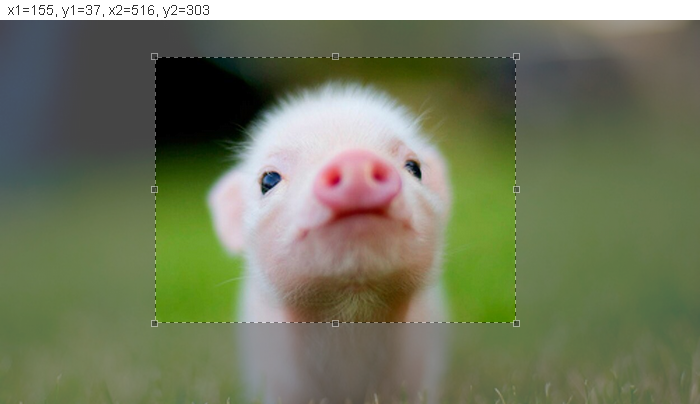

# angular-crop
angular-crop is a [Jcrop](http://deepliquid.com/content/Jcrop.html) wrapper for [angular](https://angularjs.org/) framework. It offers a angular directive and a angular service that add image cropping functionality to your web application. The reason not to provide by angular module is that current angular module dependencies does not support load-on-demand, meaning that all module dependencies must be loaded before creating application module. load-on-demand feature is very significant in large scale SPA applications.

Good practice to build large scale SPA applications: <br>
[http://weblogs.asp.net/dwahlin/dynamically-loading-controllers-and-views-with-angularjs-and-requirejs](http://weblogs.asp.net/dwahlin/dynamically-loading-controllers-and-views-with-angularjs-and-requirejs)
[http://www.codeproject.com/Articles/808213/Developing-a-Large-Scale-Application-with-a-Single](http://www.codeproject.com/Articles/808213/Developing-a-Large-Scale-Application-with-a-Single) <br>

# Screenshot


# Install
```console
npm install angular-crop 
```

# Dependencies
Jcrop

# Usage
angular-crop is an object containing a directive method and a service method that you can feed it to angular.directive() and 
angular.service() directly. <br>
directive: js function, you can feed it to angular.directive() as second parameter;<br>
service: js function, you can feed it to angular.service() as second parameter; <br>
## traditional global namespace 
include files:
```html
<link rel="stylesheet" href="css/jquery.Jcrop.css">
<script type="text/javascript" src="js/jquery-1.11.0.js"></script>
<script type="text/javascript" src="js/jquery.Jcrop.min.js"></script>
<script type="text/javascript" src="js/angular-crop.js"></script>
```
controller: 
```js
var app = angular.module('app', []);
app.directive('angularCrop', angularCrop.directive);
app.controller('controllerName', function () {
	$scope.data = {
		x1: 0,
		y1: 0,
		x2: 200,
		y2: 200
	};
	$scope.events = {
		onChange: function () {
			console.log('changed', $scope.data);
		},
		onSelect: function () {
			console.log('selected', $scope.data);
		}
	};
});
```
view:
```html

```

## load angular-crop using requireJS
controller:
```js
define(['app', 'angular-crop'], function (app, angularCrop) {
	app.register.directive('angularCrop', angularCrop.directive);
	app.register.controller('controllerName', function ($scope, $css) {
		$css.bind({href: 'app/views/css/jquery.Jcrop.css'}, $scope);
		$scope.data = {
			x1: 0, 
			y1: 0,
			x2: 200,
			y2: 200
		};
		$scope.events = {
			onChange: function () {
				console.log('changed', $scope.data);
			},
			onSelect: function () {
				console.log('selected', $scope.data);
			}
		};
	});
});
```
view:
```html

```

or you can use service instead of directive. <br>
controller:
```js
define(['app', 'angular-crop'], function (app, angularCrop) {
	app.register.service('angularCrop', angularCrop.service);
	app.register.controller('controllerName', function ($scope, $css, angularCrop) {
		$css.bind({href: 'app/views/css/jquery.Jcrop.css'}, $scope);
		$scope.data = {
			x1: 0, 
			y1: 0,
			x2: 200,
			y2: 200
		};
		$scope.events = {
			onChange: function () {
				console.log('changed', $scope.data);
			},
			onSelect: function () {
				console.log('selected', $scope.data);
			}
		};
		angularCrop.angularCrop($('#imgID'), $scope.data, $scope.events);
	});
});
```
view:
```html

```

# API
```html

```
data is an object containing: <br>
* x1, y1, x2, y2: Selection area, in pixels.
* ratio: Aspect ratio of w/h (e.g. 1 for square)

events is an object containing:
* onChange: Called when the selection is moving
* onSelect: Called when the selection is completed


